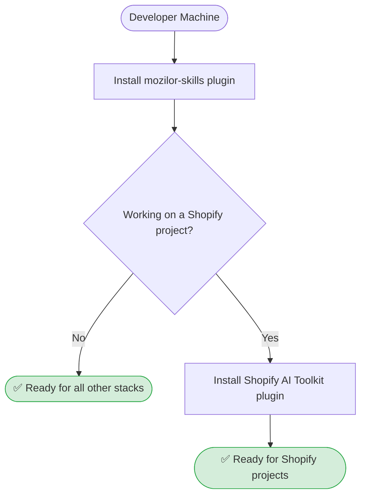
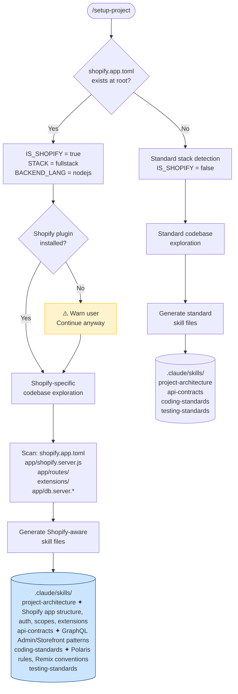
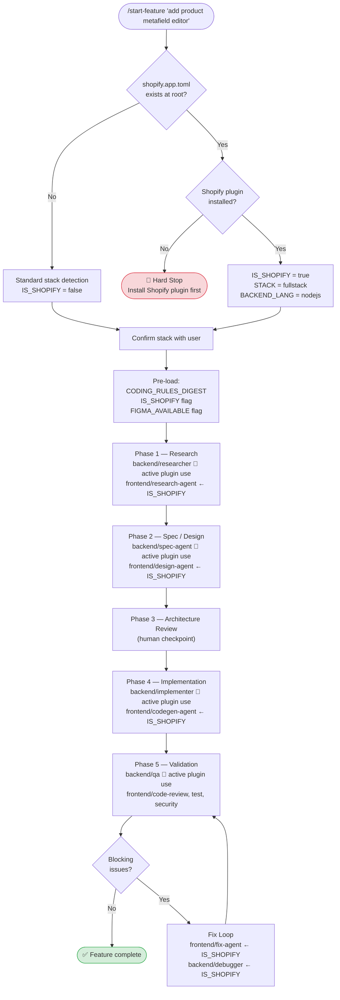
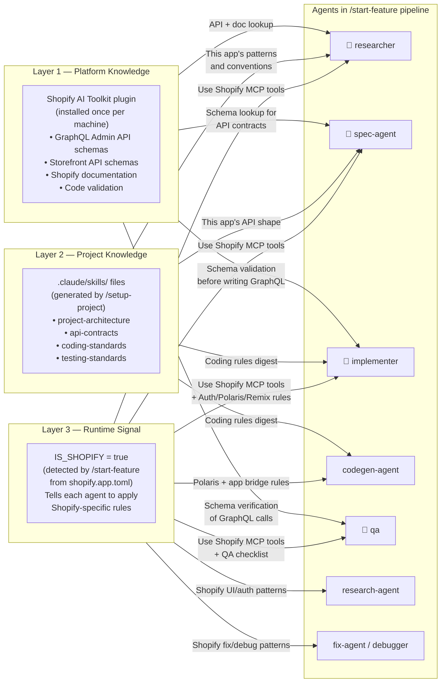

# Shopify Integration Flow

How the mozilor-skills plugin integrates with the Shopify AI Toolkit to support Shopify app development.

---

## 1. Developer Machine Setup (one time)



> The Shopify AI Toolkit plugin is only needed once per machine, not per project.

---

## 2. Per-Project Setup — `/setup-project`



> `testing-standards` includes Shopify-specific content: session mocking, GraphQL mocking, webhook testing, and required env vars.

---

## 3. Per-Feature Development — `/start-feature`



---

## 4. Three Layers Working Together



---

## Active vs Passive Plugin Usage

🔌 = agent actively calls `search_docs_chunks` / `fetch_full_docs` at runtime
← = agent receives IS_SHOPIFY flag and applies hardcoded Shopify rules (passive)

| Agent | Plugin usage | What it does with the plugin |
|---|---|---|
| `backend/researcher` | 🔌 Active | Looks up API schemas and docs before codebase research |
| `backend/spec-agent` | 🔌 Active | Looks up exact field names/types before writing GraphQL contracts |
| `backend/implementer` | 🔌 Active | Validates schema before writing every GraphQL query or mutation |
| `backend/qa` | 🔌 Active | Verifies all GraphQL operations in changed files against current schema |
| `frontend/research-agent` | ← Passive | Applies Shopify-aware research patterns (Polaris lookup, constraint flagging) |
| `frontend/design-agent` | ← Passive | Specs Polaris components, GraphQL contracts, Remix loader/action |
| `frontend/codegen-agent` | ← Passive | Enforces Polaris, app bridge, loader/action during code generation |
| `frontend/fix-agent` | ← Passive | Applies Shopify fix constraints (Polaris, auth, userErrors) |
| `backend/debugger` | ← Passive | Applies Shopify-specific root cause patterns |

---

## Plugin Check Gates

| Command | Plugin missing | Reason |
|---|---|---|
| `/setup-project` | ⚠️ Warn and continue | Only reads the codebase — plugin not needed to generate skill files |
| `/start-feature` | 🛑 Hard stop | 4 agents actively call plugin tools — pipeline breaks without it |

Plugin check command (confirmed working):
```bash
claude plugin list | grep -A3 "shopify-plugin" | grep "✔ enabled"
```
